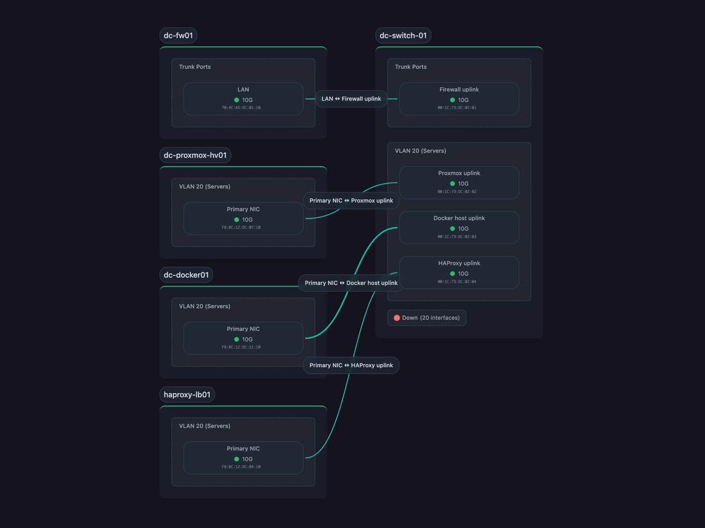
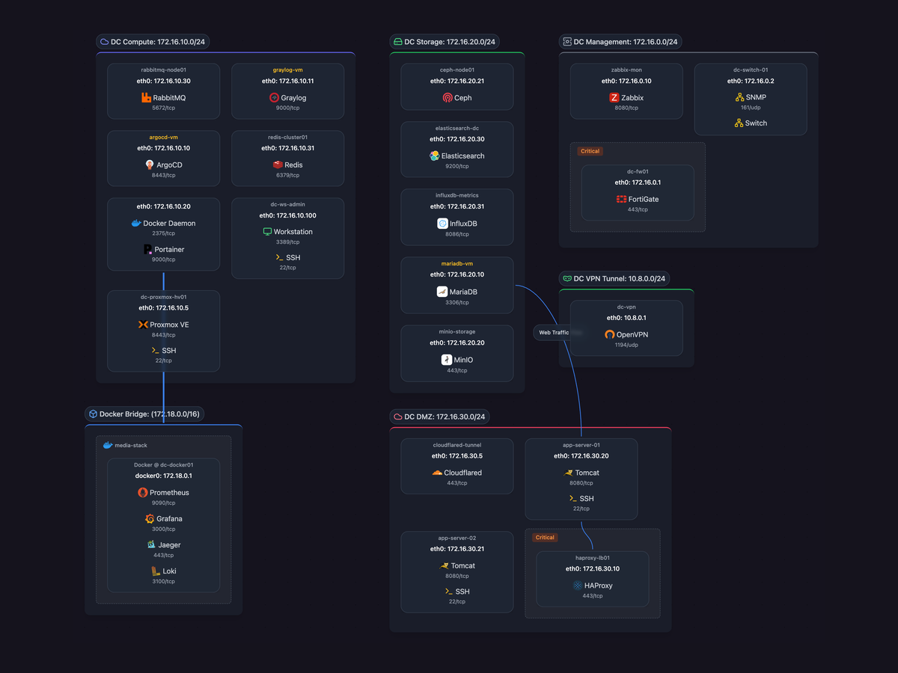
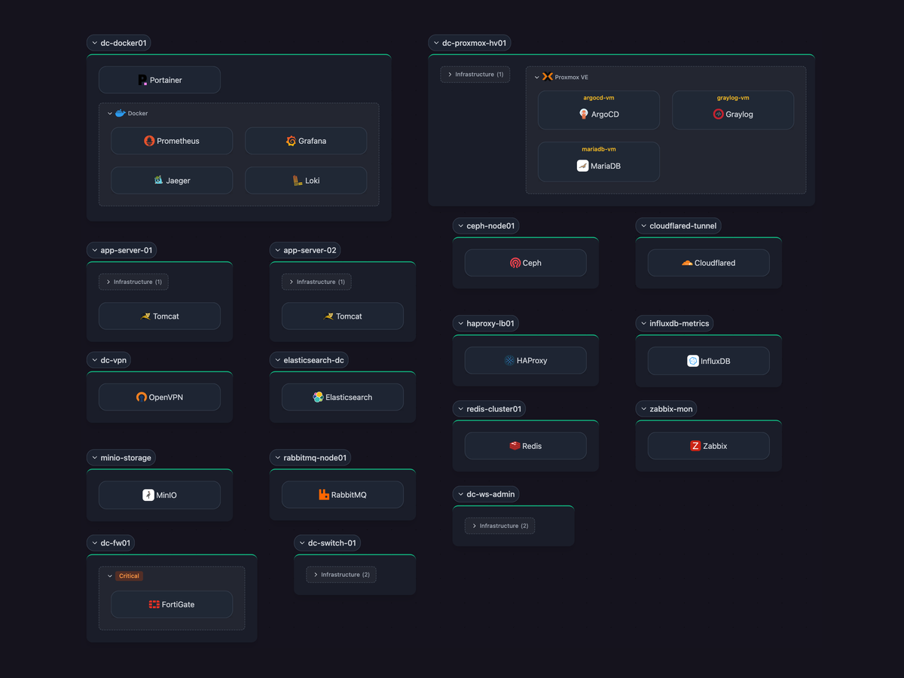
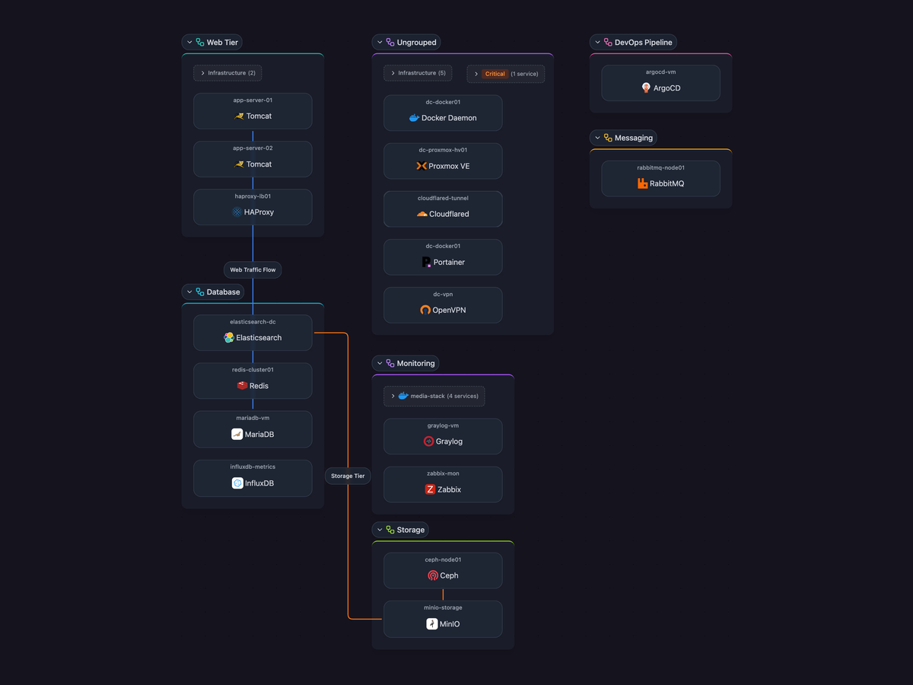

# Scanopy

<p align="left">
  
</p>

**Network documentation, without the drawing.**

Scanopy replaces manual network diagrams with a continuously maintained model of what's actually running. A single daemon scans on a schedule and produces four views from each scan: L2 (physical), L3 (logical), workloads, and applications. Unlike diagrams drawn in draw.io that go stale the week they're saved, or IaC state that misses drift and resources provisioned outside the pipeline, Scanopy reflects the current state of your infrastructure. Export as SVG, Mermaid, or Confluence; embed live maps; or feed the model into your existing source of truth.

  <br>
 <br>
 <br>
    <br>
[](https://discord.gg/b7ffQr8AcZ) [](https://hosted.weblate.org/engage/scanopy/)

> 💡 **Prefer not to self-host?** [Get a free trial](https://scanopy.net) of Scanopy Cloud

<table>
  <tr>
    <td width="50%" valign="top">
      
      <p align="center"><strong>L2 (Physical)</strong><br/><sub>Every switch, every port, every link.</sub></p>
    </td>
    <td width="50%" valign="top">
      
      <p align="center"><strong>L3 (Logical)</strong><br/><sub>Subnets, VLANs, and how hosts bridge them.</sub></p>
    </td>
  </tr>
  <tr>
    <td width="50%" valign="top">
      
      <p align="center"><strong>Workloads</strong><br/><sub>Bare metal to hypervisors to containers.</sub></p>
    </td>
    <td width="50%" valign="top">
      
      <p align="center"><strong>Applications</strong><br/><sub>Services and their dependencies, grouped by application.</sub></p>
    </td>
  </tr>
</table>

## ✨ Features

- **Automatic discovery**: Maps hosts and services by scanning the network. One scanner, no per-device agents.
- **230+ service definitions**: Auto-detects databases, web servers, containers, network infrastructure, and enterprise applications.
- **Four views from one scan**: L2 (physical), L3 (logical), workloads, and application dependencies.
- **Distributed scanning**: Deploy daemons across segments to map multi-site and multi-VLAN topologies.
- **Docker & SNMP integration**: Native discovery for containerized services and network hardware.
- **Scheduled rescans**: Documentation stays current as infrastructure changes.
- **Multi-user + RBAC**: Organization management, role-based access, and shareable live views for teammates or external stakeholders.

## 🎯 Perfect For

- **Platform & DevOps teams**: Trace service dependencies without APM. Map containers, VMs, and hardware in one model.
- **Network engineers**: Multi-VLAN, multi-site topology diagrams derived from SNMP, LLDP, and ARP. No manual drawing.
- **IT operations**: Keep inventory, topology, and dependencies current across teams and sites.
- **MSPs**: Per-client documentation with shareable live views.
- **Home labs**: Document your infrastructure without opening draw.io.

## 📋 Licensing
**Self-hosted ([AGPL-3.0](LICENSE.md)):** Free for all use. Requires source disclosure for network services and copyleft compliance.   
**Self-hosted ([Commercial license](COMMERCIAL-LICENSE.md)):** For those who cannot comply with AGPL-3.0 terms. Contact licensing@scanopy.net  
**Hosted Solution:** **[Scanopy Cloud](https://scanopy.net)** subscription for zero infrastructure management  

## 🚀 Quick Start for Self Hosting

**Docker Compose**

```bash
curl -O https://raw.githubusercontent.com/scanopy/scanopy/refs/heads/main/docker-compose.yml
docker compose up -d
```

**Proxmox**

Use this [helper script](https://community-scripts.github.io/ProxmoxVE/scripts?id=scanopy) to create a Scanopy LXC.

**Unraid**

Available as an Unraid community app.

> 💡 **Prefer not to self-host?** [Get a free trial](https://scanopy.net) of Scanopy Cloud

---

Access the UI at `http://<your-server-ip>:60072`, create your account, and wait for the first discovery to complete.

For detailed setup options and configuration, see the [Installation Guide](https://scanopy.net/docs/server-installation).

## 📚 Documentation + API

**[scanopy.net/docs](https://scanopy.net/docs)**

## 🚀 Demo

**[demo.scanopy.net](https://demo.scanopy.net/)**. Hosted demo app with a sample dataset. Try the full UI without installing anything.

## 🤝 Contributing

We welcome contributions! See our [contributing guide](contributing.md) for details.

Great first contributions:
- [Adding service definitions](contributing.md#adding-service-definitions)
- [Translating Scanopy](https://hosted.weblate.org/engage/scanopy/) into your language

## 💬 Community & Support

- **Discord**: [Join our Discord](https://discord.gg/b7ffQr8AcZ) for help and discussions
- **Issues**: [Report bugs or request features](https://github.com/scanopy/scanopy/issues/new)
- **Discussions**: [GitHub Discussions](https://github.com/scanopy/scanopy/discussions)

---
**Translations powered by Weblate**

**Built with ❤️ in NYC**
